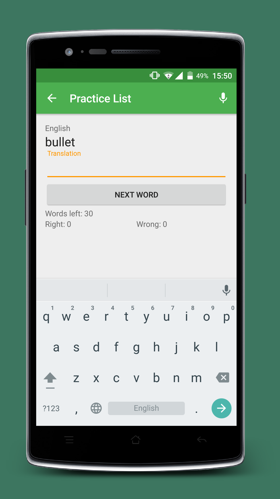

# woording-android
[](https://travis-ci.org/woording/woording-android)

Woording's Android app.

This app is built with de latest Android-Studio Preview and the latest alpha version of Gradle.

#### Beta
The first beta is now released. If you want to test, you have to [opt-in](https://play.google.com/apps/testing/com.woording.android) and then you can download it from Google Play.

#### Screenshots
First screenshots are here

Phone:



Tablet:


#### Submodules
To clone the submodules you have to clone this project normally and then run the following commands:
```bash
git submodule init
git submodule update
```

To update submodules do:
```bash
git submodule foreach git pull
```

#### Libraries & Licences
Woording-android makes use of the following libraries
- Android Support Libraries
	* Licensed under Creative Commons Attribution 2.5
- MaterialDrawer
	* [Site](http://mikepenz.github.io/MaterialDrawer/)
	* Apache 2.0 License
- Volley
	* [Site](http://developer.android.com/training/volley/index.html)
	* Apache 2.0 License
	* I use my own version of it which you can find [here](https://github.com/PhiliPdB/VolleyImproved)

Some classes are copied and edited from the Android Open Source Project which has an Apache 2.0 License.
